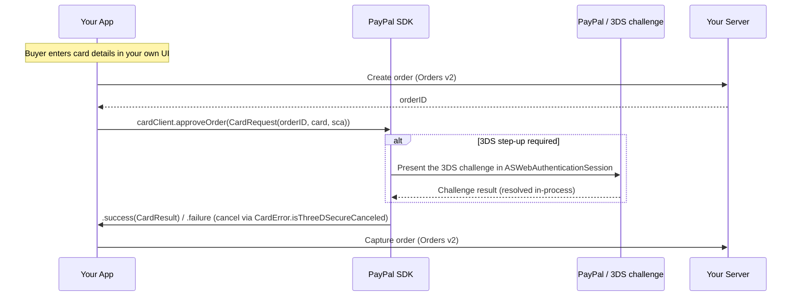

This guide shows you how to accept a **card payment** — Advanced Credit and Debit Card (ACDC) — in your iOS app with PayPal Mobile SDK V3.0.0, including Vault (with or without a purchase). The SDK ships **no card-entry UI**: you build your own fields for card number, expiry, CVV, and optionally cardholder name and billing address, and you are responsible for input validation (Luhn check, brand detection, formatting). Card checkout uses its own client, `CardClient`, and passes everything in a single `CardRequest` — it does not use `createPayPalSession()`.

On iOS, the 3D Secure (3DS) step-up — when required — is handled **entirely inside** `approveOrder()` / `vault()`: the SDK presents the challenge in an `ASWebAuthenticationSession` and resolves your completion handler once it is done. There is no separate "present the challenge" call and no return intent to forward.

> **Before you start:** complete [Install & Setup (iOS)](install-and-setup.md). Card needs **no** Associated Domains or custom-scheme registration — the 3DS challenge resolves in-process.

## Overview



## Before you begin

Complete [Install & Setup (iOS)](install-and-setup.md). For Card specifically:

* Add the `CardPayments` product.
* Construct the client from the `CoreConfig` you built in setup:

```swift
let cardClient = CardClient(config: config)
```

* No return-URL registration is needed — the 3DS challenge resolves in-process via `ASWebAuthenticationSession`.

## Server: create an order

Call the Orders v2 API server-to-server and return **only the order ID** to your app.

```shell
curl -X POST https://api-m.sandbox.paypal.com/v2/checkout/orders \
  -H 'Content-Type: application/json' \
  -H 'Authorization: Bearer <access-token>' \
  -d '{ "intent": "CAPTURE", "purchase_units": [ { "amount": { "currency_code": "USD", "value": "49.99" } } ] }'
```

## Integrate Card

### Step 1: Collect the card and create the order

Build your own card-entry UI (the SDK provides no fields), then create the order on your server.

```swift
let card = Card(
    number: "4111111111111111",
    expirationMonth: "01",
    expirationYear: "2028",
    securityCode: "123",
    cardholderName: "Jane Smith",                // optional
    billingAddress: Address(countryCode: "US")   // optional
)

let orderID = try await myServer.createOrder()
```

### Step 2: Approve the order

If a 3DS challenge is required, the SDK presents it automatically — the completion does not fire until the challenge (if any) is fully resolved.

```swift
let request = CardRequest(
    orderID: orderID,
    card: card,
    sca: .scaWhenRequired   // or .scaAlways to force a challenge every time
)

cardClient.approveOrder(request: request) { result in
    switch result {
    case .success(let cardResult):
        captureOrder(cardResult.orderID)   // cardResult.didAttemptThreeDSecureAuthentication also available
    case .failure(let error):
        if CardError.isThreeDSecureCanceled(error) {
            showCheckoutScreen()
        } else {
            showError(error.localizedDescription)
        }
    }
}

// An async/await variant is also available:
// let result = try await cardClient.approveOrder(request: request)
```

### Step 3: Capture the order

```swift
func captureOrder(_ orderID: String) {
    // POST /v2/checkout/orders/{orderID}/capture on your server
    myServer.captureOrder(orderID)
}
```

## Vault with Purchase

Save the card **while** completing a purchase, in one approval — the same `approveOrder()` sequence as above. The only difference is that your server creates the order with `payment_source.card.attributes.vault` set:

```shell
curl -X POST https://api-m.sandbox.paypal.com/v2/checkout/orders \
  -H 'Content-Type: application/json' \
  -H 'Authorization: Bearer <access-token>' \
  -d '{
    "intent": "CAPTURE",
    "purchase_units": [ { "amount": { "currency_code": "USD", "value": "49.99" } } ],
    "payment_source": { "card": { "attributes": { "vault": { "store_in_vault": "ON_SUCCESS" }, "customer": { "id": "<existing-or-new-customer-id>" } } } }
  }'
```

On approval the SDK result still only carries the order ID, status, and `didAttemptThreeDSecureAuthentication` — **it does not return a payment token.** Retrieve the saved card's token server-side after capture.

## Vault without Purchase

Save a card with no purchase now. Follows the identical pattern against a setup token.

```swift
let vaultRequest = CardVaultRequest(card: card, setupTokenID: setupTokenID)

cardClient.vault(vaultRequest) { result in
    switch result {
    case .success(let vaultResult):
        savePaymentToken(vaultResult.setupTokenID)   // vaultResult.didAttemptThreeDSecureAuthentication also available
    case .failure(let error):
        showError(error.localizedDescription)
    }
}

// An async/await variant is also available:
// let result = try await cardClient.vault(vaultRequest)
```

## Result handling

Card delivers a single `Result` — the 3DS challenge (if any) resolves inline before it fires. Cancellation of the challenge is represented as a failure, not a separate case.

| Outcome | How it is delivered | What you do |
| --- | --- | --- |
| **Success** | `.success` — `CardResult` / `CardVaultResult` with the order (or setup token) ID, status, and `didAttemptThreeDSecureAuthentication` | Capture the order or store the setup token. |
| **3DS canceled** | `.failure` where `CardError.isThreeDSecureCanceled(error)` is `true` | Return the buyer to your checkout screen; no charge was made. |
| **Other failure** | `.failure` — e.g. `CardError.threeDSecureURLError` (challenge URL failed iOS's PayPal 3DS validation) | Show `error.localizedDescription`. |

> **Platform note:** iOS validates that a 3DS challenge URL is a genuine PayPal 3DS page before opening it. (Android opens whatever URL comes back on the `payer-action` link.)

## Testing and go-live

| Scenario | Expected result |
| --- | --- |
| **No challenge required** | `approveOrder()` / `vault()` resolves with success and `didAttemptThreeDSecureAuthentication = false`. |
| **3DS challenge required** | The buyer completes the challenge inline; the completion fires with `didAttemptThreeDSecureAuthentication = true`. |
| Buyer cancels the 3DS challenge | `CardError.isThreeDSecureCanceled(error)` is `true`; no charge is made. |
| `sca: .scaAlways` | Every approval attempts a challenge — useful for testing the challenge path on demand. |
| Vault with Purchase | Order captures; the saved card's token is retrievable server-side (not from the SDK result). |

### Go live

- [ ] Validate card input in your own UI (Luhn, brand, formatting) — the SDK does not.
- [ ] Switch `.sandbox` to `.live` and use your live client ID and merchant ID.
- [ ] Confirm success, 3DS-canceled (`CardError.isThreeDSecureCanceled`), and other failures are handled.
- [ ] Contact your PayPal account team to enable ACDC for production traffic.

## Related

* [Install & Setup (iOS)](install-and-setup.md)
* [Troubleshooting (iOS)](troubleshooting.md)
* [Orders v2 API](https://developer.paypal.com/docs/api/orders/v2/)
