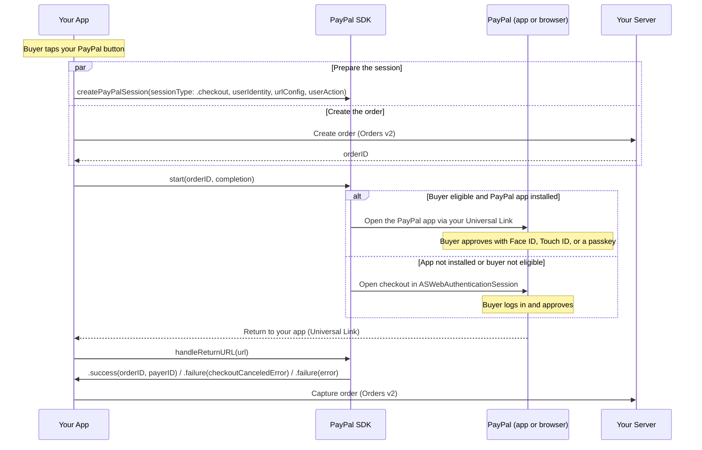

This guide shows you how to accept a **PayPal payment** in your iOS app with PayPal Mobile SDK V3.0.0 — One-Time Checkout, Vault (with or without a purchase), and Pay Later / PayPal Credit. The **PayPal button** is the highlighted way to start checkout: when the buyer taps it, checkout happens in the PayPal app if they are eligible and have it installed — approving with Face ID, Touch ID, or a passkey — then returns to your app through your Universal Link. If the PayPal app is not installed or the buyer is not eligible, checkout continues in an in-app browser automatically.

> **Before you start:** complete [Install & Setup (iOS)](../getting-started/install-and-setup.md). It covers the SDK dependency, `CoreConfig`, and return-link registration shared by every payment method.

## Overview

When the buyer taps your PayPal button, you call `createPayPalSession()` (with the session type, an optional buyer identity, return URLs, and user action) and create the order — then call `start()` with just the order ID. `createPayPalSession()` is required and must come first.

**Prepare the session before checkout.** `start()` requires a prepared shopper session, created by `createPayPalSession()`. Until it has been called, `start()` will not proceed — it returns a `PayPalError.sessionNotStartedError` on its completion handler. Preparing the session carries the buyer identity, return URLs, and user action to PayPal and determines whether checkout uses the PayPal app or the in-app browser.

**Create the session when the buyer shows intent.** Call `createPayPalSession()` from your PayPal button's action, ideally at the same time as you create the order, so its network latency overlaps order creation and it is ready by the time you call `start()`.



## How the SDK works

The SDK handles the client-side of checkout. It does not create or capture orders — your server does that with the Orders v2 API. Your responsibilities are: configure the client (see Install & Setup); in your button's action call `createPayPalSession()`, create the order, and pass its ID to `start()`; then forward the return URL to the SDK and capture. Choosing the experience (PayPal app vs. in-app browser) and returning the buyer are handled for you. The one ordering rule is that `createPayPalSession()` must be called before `start()`.

## Before you begin

Complete [Install & Setup (iOS)](../getting-started/install-and-setup.md). For PayPal Checkout specifically:

* Add the `PayPalPayments` and `PaymentButtons` products.
* Construct the client from the `CoreConfig` you built in setup:

```swift
let checkoutClient = PayPalClient(config: config)   // config + urlConfig from Install & Setup
```

## Server: create an order

Call the Orders v2 API server-to-server and return **only the order ID** to your app. Return and cancel URLs are passed to the SDK via the URL config (from Install & Setup), not in the Orders API body.

```shell
curl -X POST https://api-m.sandbox.paypal.com/v2/checkout/orders \
  -H 'Content-Type: application/json' \
  -H 'Authorization: Bearer <access-token>' \
  -d '{ "intent": "CAPTURE", "purchase_units": [ { "amount": { "currency_code": "USD", "value": "49.99" } } ] }'
```

## Integrate PayPal Checkout

### Step 1: Add the PayPal button

Render a `PayPalButton` on your checkout screen with an action. It needs no order or session to display.

```swift
// SwiftUI
PayPalButton.Representable(color: .gold, size: .collapsed) {
    beginCheckout()   // Steps 2-4
}
```

For the button's colors, labels, edges, and sizes — UIKit usage, and the Pay Later / PayPal Credit buttons — see [Payment Buttons (iOS)](payment-buttons.md).

### Step 2: Create the PayPal session

Call this in the button's action, before or alongside order creation. It returns immediately and prepares the session in the background.

```swift
checkoutClient.createPayPalSession(
    sessionType:  .checkout,
    userIdentity: PayPalUserIdentity(email: "buyer@example.com", phone: nil),  // optional — omit or pass nil when you have no hint
    urlConfig:    urlConfig,
    userAction:   .continue   // .payNow for a "Pay Now" button
)
```

### Step 3: Collect device data

Collect device data before you create the order, and attach the resulting risk data to your create-order request so PayPal's risk systems can reduce declines.

```swift
let dataCollector = PayPalDataCollector(config: config)
let riskCorrelationPayload = dataCollector.collectDeviceData()
// collectDeviceData() returns a JSON string, e.g. {"correlation_id":"..."} — not a bare ID.
// Send it to your server; set it as the PayPal-Client-Metadata-Id header on your Orders v2 create call.
```

### Step 4: Create the order and start checkout

```swift
let orderID = try await myServer.createOrder()   // include the client metadata ID from Step 3

checkoutClient.start(orderID: orderID) { result in
    switch result {
    case .success(let checkout):
        captureOrder(checkout.orderID)
    case .failure(let error) where PayPalError.isCheckoutCanceled(error):
        showCheckoutScreen()
    case .failure(let error):
        showError(error.localizedDescription)   // includes sessionNotStarted
    }
}
```

### Step 5: Handle the return

Forward the return URL to the SDK from your scene continuation (or `.onOpenURL` in SwiftUI). The result is delivered through the completion you passed to `start()`.

```swift
func scene(_ scene: UIScene, continue userActivity: NSUserActivity) {
    guard let url = userActivity.webpageURL else { return }
    checkoutClient.handleReturnURL(url)
}
```

### Step 6: Capture the order

```swift
func captureOrder(_ orderID: String) {
    // POST /v2/checkout/orders/{orderID}/capture on your server
    myServer.captureOrder(orderID)
}
```

## Identity — PayPalUserIdentity

You pass `userIdentity` to `createPayPalSession()`. The hint helps PayPal recognize the buyer, which can increase app-switch eligibility and approval rates. The SDK hashes email and phone (SHA-256) before sending. `userIdentity` is optional — omit it or pass `nil` when you have no buyer hint; the session is still created.

| Option | When to use |
| --- | --- |
| `PayPalUserIdentity(email:phone:)` | You know the buyer's email and/or phone. `phone` takes a `PayPalPhoneNumber(countryCode:nationalNumber:)`. |
| `PayPalUserIdentity(existingPayPalSessionID:)` | Your server already created a PayPal shopper session — pass its ID. |
| `nil` | You have no buyer hint. The session is still created. |

## Vault with Purchase

Vault with Purchase saves the buyer's PayPal account **while** completing a real purchase, in a single approval. There is no separate client call — use the exact same button → `createPayPalSession()` → `start(orderID:)` sequence above. The only difference is that your server creates the order with `payment_source.paypal.attributes.vault` set:

```shell
curl -X POST https://api-m.sandbox.paypal.com/v2/checkout/orders \
  -H 'Content-Type: application/json' \
  -H 'Authorization: Bearer <access-token>' \
  -d '{
    "intent": "CAPTURE",
    "purchase_units": [ { "amount": { "currency_code": "USD", "value": "49.99" } } ],
    "payment_source": { "paypal": { "attributes": { "vault": { "store_in_vault": "ON_SUCCESS", "usage_type": "MERCHANT", "customer_type": "CONSUMER" } } } }
  }'
```

On approval PayPal both completes the purchase and stores the payment method, but the success result still only carries `orderID` and `payerID` — **the SDK does not return a payment token for this flow.** Retrieve the vaulted token server-side (GET the order, or via the Payment Method Tokens API) after capture.

## Vault without Purchase

Save a buyer's PayPal account for future charges with no purchase now. Call `createPayPalSession()` first (use `sessionType: .vaultWithoutPurchase` and `userAction: .setupNow` for a "Set up now" button), then create the setup token on your server and call `vault(setupTokenID:completion:)`.

```swift
// In your "Set up now" button's action:
checkoutClient.createPayPalSession(
    sessionType: .vaultWithoutPurchase,
    userIdentity: userIdentity,
    urlConfig: urlConfig,
    userAction: .setupNow
)

let setupTokenID = try await myServer.createSetupToken()

checkoutClient.vault(setupTokenID: setupTokenID) { result in
    switch result {
    case .success(let vault):
        savePaymentToken(vault.tokenID)
    case .failure(let error) where PayPalError.isVaultCanceled(error):
        showVaultScreen()
    case .failure(let error):
        showError(error.localizedDescription)   // includes sessionNotStarted
    }
}
```

## Pay Later and PayPal Credit

Pay Later and PayPal Credit are alternate PayPal funding sources, surfaced through dedicated buttons rather than a separate client call — `PayPalPayLaterButton` and `PayPalCreditButton` (`PaymentButtons`). Wire each button's action to the same `createPayPalSession()` → `start(orderID:completion:)` sequence used for One-Time Checkout above; eligible buyers see Pay Later or PayPal Credit financing offers during approval automatically. Both are supported for One-Time Checkout and Vault with Purchase; neither applies to Vault without Purchase. For button colors, labels, edges, and sizes, see [Payment Buttons (iOS)](payment-buttons.md).

```swift
// SwiftUI
PayPalPayLaterButton.Representable(color: .gold, size: .collapsed) {
    beginCheckout()   // same createPayPalSession() -> start(orderID:completion:) flow as Step 2-4 above
}
```

## Result handling

Checkout (including Vault with Purchase) and Vault without Purchase each deliver a `Result<_, CoreSDKError>` with two cases — `.success` and `.failure`. Cancellation is delivered as a `.failure` with a specific error, not a separate case; check for it with `PayPalError.isCheckoutCanceled(_:)` (checkout / Vault with Purchase) or `PayPalError.isVaultCanceled(_:)` (Vault without Purchase). Handle both outcomes — cancellation is a normal buyer choice, not a failure to surface as an error.

| Outcome | How it is delivered | What you do |
| --- | --- | --- |
| **Success** | `.success` | Checkout / Vault with Purchase: capture the order. Vault without Purchase: store the returned `tokenID` and `approvalSessionID`. |
| **Cancel** | `.failure(error)` where `PayPalError.isCheckoutCanceled(error)` / `PayPalError.isVaultCanceled(error)` is `true` | Return the buyer to your checkout (or save) screen; no charge was made. |
| **Failure** | `.failure(error)` (any other error) | Show an error. `sessionNotStartedError` means `createPayPalSession()` was not called before `start()` / `vault()` — fix the ordering. |

## Best practices

**Show a loading indicator after the button tap.** Disable the button immediately after the buyer taps it, and show a loading indicator while `createPayPalSession()`, order creation, and `start()` are in flight. This prevents duplicate submissions.

**Provide buyer email and phone.** Pass both in `userIdentity` when you have them — together they improve app-switch eligibility, risk assessment, and approval rates beyond email alone.

**Handle the return to your app.** Remove the loading indicator as soon as your app returns to the foreground. If the buyer backgrounded the PayPal app without approving or canceling, let them resume rather than restarting checkout.

**Handle redirection to the browser.** Occasionally the OS opens the return in the default mobile browser instead of your app — usually because the Universal Link is not correctly associated with your domain. Setting `fallbackSchemeURL` covers the common case; as a safeguard, consider website logic that detects a redirected buyer, confirms order status, and guides them back.

## Testing and go-live

Test on a **physical device** — the app-switch path does not work on the simulator.

### Trigger the app-switch path

The SDK switches to the PayPal app only when all of the following hold; otherwise it falls back to `ASWebAuthenticationSession`:

* A physical device with the PayPal app installed (the sandbox app for sandbox testing).
* Merchant and buyer are in the US, and your integration is App Switch eligible.
* The buyer-identity email you pass to `createPayPalSession()` matches the account signed into the PayPal app.
* In the PayPal app, **Extend your login session** (and Face ID / Touch ID) are enabled under **Avatar › Login and security**.

To test the in-app browser path, use a device without the PayPal app installed, or an ineligible buyer. Full sandbox-app setup lives in the published [PayPal iOS testing guide](https://developer.paypal.com/braintree/docs/guides/paypal/testing-go-live/ios/v6#testing-app-switch).

### Before you launch, test

| Scenario | Expected result |
| --- | --- |
| **App switch — end to end** | The buyer switches to the PayPal app, approves with Face ID / Touch ID or a passkey, returns to your app, and the order captures. |
| **In-app browser — end to end** | With the PayPal app not installed (or an ineligible buyer), checkout completes in `ASWebAuthenticationSession` and the order captures. |
| Buyer cancels in PayPal | The buyer is returned to your checkout screen and no charge is made. |
| Vault with Purchase | Order captures; the vaulted token is retrievable server-side (not from the SDK result). |
| Vault without Purchase | You receive and store the `tokenID` / `approvalSessionID`, and can charge it later. |
| Pay Later / PayPal Credit eligible buyer | Financing offers render; approval and capture proceed the same as standard PayPal. |

### Go live

- [ ] Call `createPayPalSession()` on the button tap, before or alongside order creation.
- [ ] Switch `.sandbox` to `.live` and use your live client ID and merchant ID.
- [ ] Verify the Universal Link return works in a release build (AASA hosted and verified).
- [ ] Verify the custom-scheme fallback (`fallbackSchemeURL`) is registered and returns the buyer to your app.
- [ ] Confirm all result variants (success, cancellation, failure) are handled.
- [ ] Collect device data and pass the client metadata ID on your Orders v2 request.
- [ ] Contact your PayPal account team to enable App Switch for production traffic.

## Related

* [Install & Setup (iOS)](../getting-started/install-and-setup.md)
* [Payment Buttons (iOS)](payment-buttons.md)
* [Troubleshooting (iOS)](troubleshooting.md)
* [PayPal Developer Dashboard](https://developer.paypal.com/dashboard/)
* [Orders v2 API](https://developer.paypal.com/docs/api/orders/v2/)
