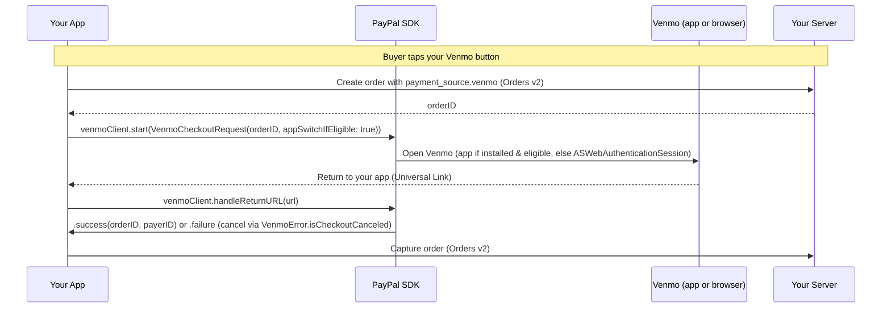

This guide shows you how to accept a **Venmo payment** (One-Time Checkout) in your iOS app with PayPal Mobile SDK V3.0.0. Venmo checkout uses its own client, `VenmoClient`, and returns to your app via the same Universal Link domain you registered in Install & Setup. When the buyer taps your Venmo button, checkout opens the Venmo app if it is installed and the buyer is eligible; otherwise it falls back to an in-app browser automatically. **Venmo supports One-Time Checkout only** — vault flows are not supported for Venmo.

> **Before you start:** complete [Install & Setup (iOS)](install-and-setup.md).

## Overview

Unlike PayPal Checkout, Venmo does **not** use `createPayPalSession()`. Everything needed for the transaction is passed in a single `VenmoCheckoutRequest` when you call `start()`.



## Before you begin

Complete [Install & Setup (iOS)](install-and-setup.md). For Venmo specifically:

* Add the `VenmoPayments` product.
* Construct the client from the `CoreConfig` you built in setup:

```swift
let venmoClient = VenmoClient(config: config)
```

* Unlike PayPal Checkout, `VenmoClient` doesn't take a `PayPalURLConfig` or any URL config from the SDK — it never reads `fallbackSchemeURL` or Associated Domains settings from `CoreConfig`. The URL it opens to switch to Venmo is a fixed, SDK-built checkout URL with no merchant-configurable return path. The buyer's way back to your app instead comes from the `return_url` / `cancel_url` you set per-order, server-side (see below) — as long as those sit under the same Universal Link domain you registered in Install & Setup, iOS delivers the return through your `scene(_:continue:)` / `.onOpenURL` handler, and `venmoClient.handleReturnURL(url)` parses the result from that URL. There is currently no custom-scheme fallback for Venmo — if the Universal Link isn't verified, there's no documented fallback path back to your app.
* Add `com.venmo.touch.v2` under `LSApplicationQueriesSchemes` in Info.plist — the SDK uses it to detect whether the Venmo app is installed. This is in addition to the `paypal` entry from Install & Setup, not a replacement for it.

## Server: create the order with the Venmo payment source

Call the Orders v2 API server-to-server with a **Venmo** payment source. `app_switch_context.source: "NATIVE_APP"` tells Venmo the order originated from a native app-switch flow. Return only the order ID to your app.

```shell
curl -X POST https://api-m.sandbox.paypal.com/v2/checkout/orders \
  -H 'Content-Type: application/json' \
  -H 'Authorization: Bearer <access-token>' \
  -d '{
    "intent": "CAPTURE",
    "purchase_units": [ { "amount": { "currency_code": "USD", "value": "49.99" } } ],
    "payment_source": { "venmo": { "experience_context": {
      "return_url": "https://example.com/merchant-app/return",
      "cancel_url": "https://example.com/merchant-app/cancel",
      "app_switch_context": { "source": "NATIVE_APP" }
    } } }
  }'
```

## Integrate Venmo

### Step 1: Start Venmo checkout

On the buyer's tap, create the order (with the Venmo payment source above), build a `VenmoCheckoutRequest`, and call `start()`. Set `appSwitchIfEligible` to `true` to allow the app-switch path; when the Venmo app is not installed, or `appSwitchIfEligible` is `false`, checkout falls back to `ASWebAuthenticationSession` automatically.

```swift
let request = VenmoCheckoutRequest(
    orderID: orderID,
    appSwitchIfEligible: true,
    currency: "USD"   // defaults to "USD"
)

venmoClient.start(request: request) { result in
    switch result {
    case .success(let checkout):
        captureOrder(checkout.orderID)   // checkout.payerID also available
    case .failure(let error):
        if VenmoError.isCheckoutCanceled(error) {
            showCheckoutScreen()
        } else {
            showError(error.localizedDescription)
        }
    }
}

// An async/await variant is also available:
// let result = try await venmoClient.start(request: request)
```

### Step 2: Handle the return

Forward the incoming URL to the SDK from your scene continuation (or `.onOpenURL` in SwiftUI). This resolves the completion you passed to `start()`.

```swift
func scene(_ scene: UIScene, continue userActivity: NSUserActivity) {
    guard let url = userActivity.webpageURL else { return }
    venmoClient.handleReturnURL(url)
}
```

### Step 3: Capture the order

```swift
func captureOrder(_ orderID: String) {
    // POST /v2/checkout/orders/{orderID}/capture on your server
    myServer.captureOrder(orderID)
}
```

## Result handling

Venmo delivers a single `Result<VenmoCheckoutResult, CoreSDKError>`. Cancellation is represented as a failure, not a separate case — check for it with `VenmoError.isCheckoutCanceled(error)`.

| Outcome | How it is delivered | What you do |
| --- | --- | --- |
| **Success** | `.success` — `VenmoCheckoutResult` with `orderID` and `payerID` | Capture the order. |
| **Cancel** | `.failure` where `VenmoError.isCheckoutCanceled(error)` is `true` | Return the buyer to your checkout screen; no charge was made. |
| **Other failure** | `.failure` — e.g. `VenmoError.fundingEligibilityError(reason:)` (Venmo not eligible on the web-fallback path), `venmoURLError`, or `malformedResultError` | Show `error.localizedDescription`. |

## Testing and go-live

Follow the same physical-device approach as PayPal App Switch, with two differences: sign in to the sandbox app with a **Venmo** (not just PayPal) test account, and create the order with the Venmo payment source shown above.

| Scenario | Expected result |
| --- | --- |
| **App switch — end to end** | With the Venmo app installed and eligible, the buyer switches to Venmo, approves, returns to your app, and the order captures. |
| **Web fallback — end to end** | With the Venmo app not installed (or `appSwitchIfEligible: false`), checkout completes in `ASWebAuthenticationSession` and the order captures. |
| Buyer cancels in Venmo | The completion resolves with a canceled failure (`VenmoError.isCheckoutCanceled`); no charge is made. |

### Go live

- [ ] Switch `.sandbox` to `.live` and use your live client ID and merchant ID.
- [ ] Verify the Universal Link return works in a release build; confirm your order's `return_url`/`cancel_url` share the same domain as that Universal Link. Confirm `com.venmo.touch.v2` is declared under `LSApplicationQueriesSchemes`.
- [ ] Confirm success, cancel (`VenmoError.isCheckoutCanceled`), and other failures are handled.
- [ ] Contact your PayPal account team to enable Venmo for production traffic.

## Related

* [Install & Setup (iOS)](install-and-setup.md)
* [Troubleshooting (iOS)](troubleshooting.md)
* [Orders v2 API](https://developer.paypal.com/docs/api/orders/v2/)
